# AI-Powered Medical Report Simplifier  
Render URL : https://plum-9xi0.onrender.com/api/simplify

**Problem Statement 7**  
Focus Area: OCR → Test Extraction → Plain-Language Explanation  

This backend service processes medical reports (typed or scanned) and generates **patient-friendly summaries**. It extracts test names and values, normalizes them, ensures no hallucinated results, and produces easy-to-understand explanations.  

---

## Features  
- **OCR/Text Extraction**: Extracts text from uploaded images/PDFs using [Tesseract.js](https://tesseract.projectnaptha.com/).  
- **Normalization**: Standardizes test names, values, units, and ranges.  
- **AI-Powered Simplification**: Uses Gemini API to generate plain-language explanations.  
- **Guardrails**: Validates output to prevent hallucinated tests using string similarity checks.  
- **API-based Access**: Provides endpoints for uploading reports and fetching simplified summaries.  

---

## Tech Stack  
- **Backend**: Node.js, Express.js  
- **OCR**: Tesseract.js  
- **AI**: Gemini API (`@google/genai`)  
- **Validation**: `string-similarity` for test name matching  
- **Middleware**: Multer (file upload)  

---

## Project Architecture  

```mermaid
graph LR
    A[User Uploads File/Text] --> B[OCR Engine: Tesseract.js]
    B --> C[Extracted Raw Text]
    C --> D[Send to Gemini API]
    D --> E[AI Response: Structured JSON]
    E --> F[Validation Layer: String Similarity Check]
    F --> G[Remove Hallucinated Tests]
    G --> H[Final JSON with Tests + Patient Summary]
    H --> I[Return Response to User]
```



--- 
## Installation
### 1. Clone Repository
```
git clone https://github.com/vedant-radke/PLUM.git
cd PLUM
```

### 2. Install Dependencies
```
npm install
```

### 3. Environment Variables
Create a .env file in the project root:
```
PORT=3000
GEMINI_API_KEY=your_gemini_api_key_here

```

### Start Server
```
npm start
```
Server will run on: http://localhost:3000

---
## API Usage
### URL (Deployed on Render)
https://plum-9xi0.onrender.com/api/simplify


### Supported Inputs
```
File Upload → key: report_file (image or PDF of medical report)
Text Input → key: report_text (direct text content of report)
```
